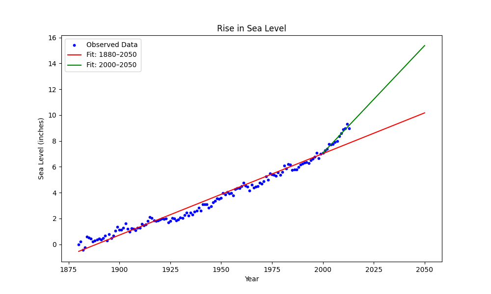

# 🌊 Sea Level Predictor

This project is part of the *FreeCodeCamp Data Analysis with Python* certification.  
It analyzes historical sea level data from 1880 to the present and predicts future sea levels through 2050 using linear regression.  

## 📌 Project Overview  

The script produces:  
- A *scatter plot* of observed sea level data (1880–present).  
- A *line of best fit* using the entire dataset (1880–2050).  
- A *line of best fit* using only recent data (2000–2050).  

These predictions help visualize long-term and recent sea level trends.  

## 🛠 Technologies Used  
- Python 🐍  
- Pandas 📊  
- Matplotlib 📈  
- SciPy ⚙  

## 📂 Dataset  
- File: epa-sea-level.csv  
- Contains historical sea level measurements from the U.S. Environmental Protection Agency (EPA).  

## 📸 Visualization  

  

